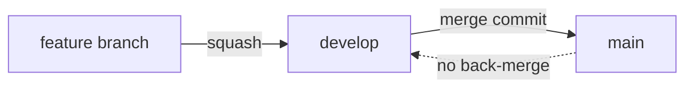
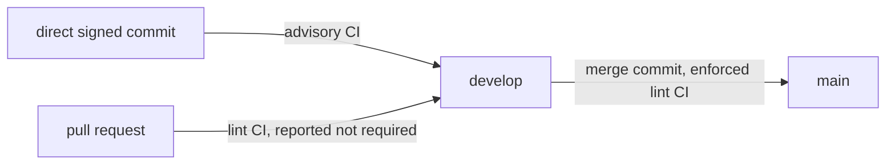
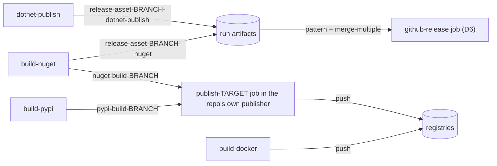
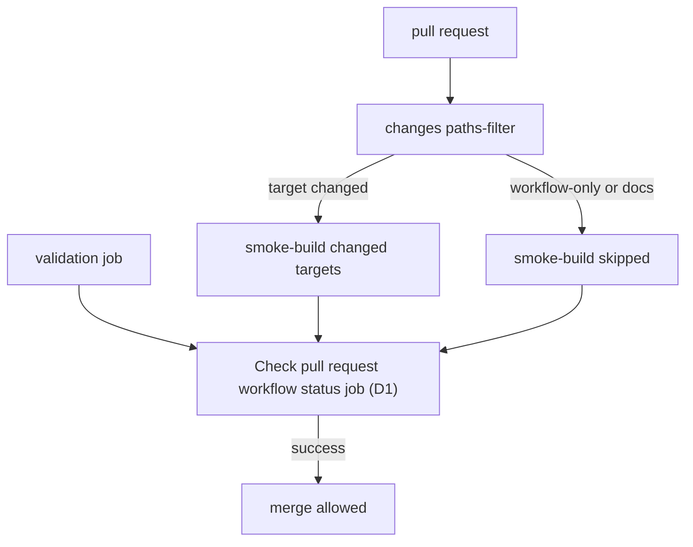
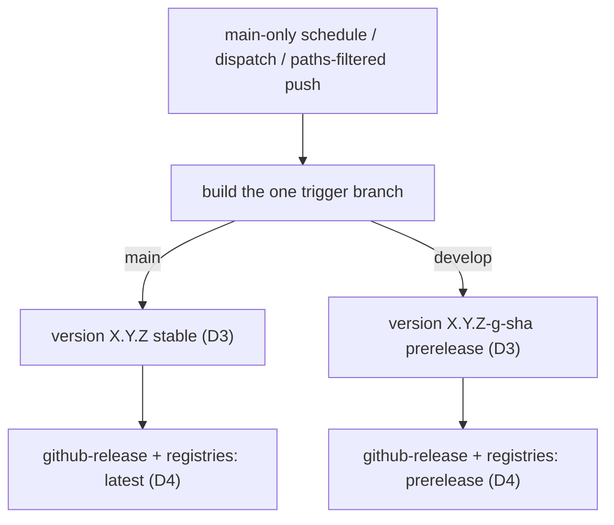

# The Pipeline Architecture

The section below is `WORKFLOW.md` section 3, whole. The D-guarantees it cites by number are `WORKFLOW.md` section 4, carried whole in `d-guarantees.md` beside this file.

## The Architecture

<!-- include: WORKFLOW.md > 3. Architecture -->

### Branch Model

Two workflow models, set per repo by the registry `workflowModel` field. `release` (default) is the feature-branch pipeline `WORKFLOW.md` specifies:

`operational` repos (live-service config, `workflowModel: operational`) commit directly to `develop` and promote a known-good snapshot to `main` via an occasional PR:

The direct commit is an **allowance, not a substitute for review**. The ruleset drops the pull-request *requirement*, which permits a direct push without withdrawing the pull request, so a change worth reviewing still takes one and both paths reach `develop` legally. Which changes those are is stated as a shape rather than a line count in `GOVERNANCE.md` "Operational Repositories", which owns the test and is the one place it is written, since nothing in a ruleset can apply it. What differs is when validation lands. On the direct-commit path the commit is already on the branch, so CI can only be advisory after the fact, and that is the accepted cost of the model. On the pull-request path the change has not landed, so validation is pre-merge and actionable, which is the moment it is worth the most, and the lint workflow's `pull_request` trigger therefore names `develop` alongside `main` (`WORKFLOW.md` section 6). That is what makes **D1.2** hold here, since its input is *any* PR and the operational model is no exception. The check is reported on a `develop` PR rather than required, because a required status check on `develop` binds the direct push too and would dissolve the allowance the model is built on.

Their CI is lint/validation only (editorconfig/EOL plus domain linters such as Home Assistant or ESPHome config validation or a firmware build, but **no unit tests**), so the D-guarantees in `WORKFLOW.md` section 4 that assume a build/test pipeline are **N/A** exactly as for `source-only` (`WORKFLOW.md` section 6). What binds: the promotion gate, where the `develop -> main` PR must pass the required `Check pull request workflow status job`, and the source-only release on manual dispatch (`releaseTrigger: dispatch-only`; tag + source zip). Branch-model rulesets are specified in `GOVERNANCE.md` "Branching Model" rather than in `WORKFLOW.md`.

### Two Layers: Orchestration vs Build

- **Orchestration** is generic and forms the standardization baseline **at the job level**: the single-branch publisher, the `get-version`, `validate-release`, and `github-release` jobs, and the `changes -> smoke-build -> aggregator` shape of the PR workflow. These job *bodies* should not need per-repo edits.
- **Build** is repo-owned in shape: the `build-<target>` leaf tasks, whether this repo hosts them itself or reaches hub-hosted ones by pin.
- **What the repo curates** (by design, not a leak): the *list* of targets. This is **not** a byte-for-byte file carry. Adding or dropping a target edits the orchestrator's surface: the `enable_<target>` inputs and the `build-<target>` job + its `github-release` **and** `build-docker` `needs:` entries in the release task, **and** the `changes` paths-filter entry + output + the `smoke-build` enable-forward in the PR workflow, plus the separate `publish-<target>` job for a package target. "Verbatim" applies to the `github-release` job and the version/publish-plan logic, except that job's own `needs:` list, and never to the release task's job list or the paths-filter. Subsetting is symmetric: the same surface you trim to drop a target you extend to add a new one (e.g. a `release-asset-<branch>-library` producer needs a new `enable_library` input, a `build-library` job, its two `needs:` entries, and a `library` paths-filter entry, output, and `smoke-build` enable-forward).

### The Seam Contract

A target contributes a file to the GitHub release by uploading a workflow artifact named `release-asset-<branch>-<target>`. The release job collects **every** matching artifact by **pattern** (`pattern: release-asset-<branch>-*` + `merge-multiple: true`), never an `artifact-ids:` naming one job's output. Canonical for **every** repo, single-target included. Switching to an `artifact-id` handoff forks the release download and breaks the verbatim carry.

The diagram writes `BRANCH` and `TARGET` where the prose writes `<branch>` and `<target>`, because a mermaid label is sanitized as HTML at render and an angle-bracket placeholder is dropped as an unknown tag. This reaches node labels as well as edge labels, which is why the Release Model diagram below writes `X.Y.Z-g-sha` rather than bracketing its own placeholder.

### Reusable-Task Parameter Contract

Every leaf and the release task take `ref`, `branch` (the **logical** branch that drives config/tags/prerelease), and where relevant `smoke`. Branch-derived config keys off `inputs.branch` (the logical branch the caller passes). Artifact names are branch-suffixed.

### Versioning

NBGV versions the branch being published. Each run builds a single branch (the trigger ref), so `GITHUB_REF` already names it and NBGV classifies it directly, and no `IGNORE_GITHUB_REF` override is required. The default branch is the public-release ref, so it builds clean `X.Y.Z`. Every other branch builds a prerelease `X.Y.Z-g<sha>`. `version.json`'s `version` is the major.minor floor. NBGV appends the git height as the patch. **NBGV and `version.json` are retained even by a repo with no compiled code**, since they are the source of the release tag (`SemVer2`) and `target_commitish` (`GitCommitId`) and the prerelease classification. The .NET SDK is pulled in only as the versioning toolchain. A package build derives its registry version from the same NBGV outputs, but **not always from `SemVer2`**: the PyPI version is built from `AssemblyFileVersion` (four-part `M.N.P.B`) with a PEP 440 `.dev0` appended on the `develop` branch. A wrapper repo may drive its build/image version from an external committed `name -> version` state file while NBGV still tags the release.

### Validate-at-Entry

When a workflow's inputs carry a cross-input or input-versus-derived-state invariant, assert it **once** in a dedicated entry job/step the downstream jobs `needs:`, failing fast with `::error::` before any build or publish.

### Resource Lifecycle

Workflow artifacts are an **intra-run handoff** only. Durable copies live on the release/registry. The rule: a transfer artifact handed **between jobs** is deleted by exact name/pattern **at its point of consumption**, the delete is **gated to the half of the consumption whose failure would leave it not yet redundant** (D5.2 names the two halves), and it is **best-effort**. **Every** `upload-artifact` sets `retention-days: 1` as the universal failure-path backstop, so no terminal blanket-delete job is needed. An intermediate consumed only within the same run may rely on the retention backstop alone. The run is **never** blanket-deleted (`.artifacts[].id`). See D5.

### Fast PR Feedback

PRs validate fast and never publish: a paths-filter smoke-builds only changed targets. A validation job always runs. Smoke builds compile/lint/test but upload nothing and push nothing. One required aggregator gates the merge. See D1.

### Release Model

Each publish builds a **single branch**, the trigger ref (`main` a release, `develop` a prerelease), so there is no branch matrix and `github.ref` always names the built branch. A **human merge never auto-publishes**: a first `plan` job (`publish-plan-task.yml`) decides once and every job gates on it. A run publishes on a **code-affecting bot push to `main`** (the App merges every Dependabot/codegen PR, so `github.actor` gates it, and a shared paths filter also drops a non-substantive change like an Actions bump), a **manual dispatch** of `main`/`develop`, or a **main-only weekly schedule** (Docker, to refresh the base image). The `push` is main-only, so a develop bot merge publishes nothing (its prerelease comes via dispatch). A **source-only** repo publishes on **dispatch only**. Every release is a tag on the built commit plus a source archive, README, and LICENSE. Targets amend it with `release-asset-*` files, and a registry push contributes none, made by the Docker leaf for an image and by the separate `publish-<target>` job for a package. An unchanged version re-pushes nothing (no-op republish). Docker re-pushes by design.

### Output Seam by Destination

Pick each output's path by **where the artifact goes**:

- **File on the GitHub release** (zip, binary, packaged library): one leaf per output uploading `release-asset-<branch>-<name>`. The repo keeps `expect_release_assets: true` (its default).
- **Package-registry push** (NuGet, PyPI): the leaf builds and uploads a build artifact (`nuget-build-<branch>` / `pypi-build-<branch>`), and a separate `publish-<target>` job in the **publishing repository's own** publisher consumes it and pushes. Both registries publish through OIDC Trusted Publishing, never a stored API key, and two things put that push outside the leaf. Trusted publishing validates the OIDC token's `job_workflow_ref` claim, which names the workflow the job actually ran from, so a push made from a reusable workflow a *different* repository hosts is rejected at the token exchange, NuGet.org answering `HTTP 401` with `does not start with <owner>/<repo>/.github/workflows/`. That alone rules out a leaf another repository hosts. A leaf this repository hosts clears the claim, and the split still applies to it, because a called job declaring no `permissions:` runs under the calling job's whole grant, so a push anywhere inside the release task would put `id-token: write` on every job in it rather than at the one entry point D7.2 requires. The registered trusted-publishing policy therefore names the publisher, `publish-release.yml`. PyPI additionally gates its publish job behind an environment. NuGet.org binds its policy to the workflow file rather than to an environment and needs none. NuGet's leaf also uploads a `release-asset-*` carrying the package, and PyPI contributes none.
- **Image-registry push** (Docker): the leaf pushes the default branch multi-arch (amd64+arm64) and any other branch `amd64`-only (arm64 emulation is reserved for the released image), and contributes no `release-asset-*`.
- **Filesystem on a host the project owns** (a static site, a config tree): the leaf builds the tree, ships it to the host, and contributes no `release-asset-*`. The transport is the repo's own. What the contract fixes is that the deploy is a **separate `workflow_dispatch`** from the release, so a redeploy of an unchanged commit mints no tag and a host rebuild, a rollback, or proving a branch on a non-production environment costs nothing; that its credentials come from a **per-environment GitHub Environment** rather than the repository secret store; and that the deploy ends by asserting **what the host serves** rather than the transport's exit status (D4.6). Retention at the destination is bounded by a declared count with one side recorded as owning the prune, which is the deploy where its credential can observe the destination and the host where that credential is deliberately write-only (D5.6).
- **No file target via the release task** (Docker-only, PyPI-only, source-only): the release is tag + source zip + README + LICENSE. The caller **MUST pass `expect_release_assets: false`** to the release task. A publisher with file targets retains the default `true`. This setting is caller-specific. The default `true` fails on `fail_on_unmatched_files` when no assets exist. A **source-only** repo also passes every `enable_*` input as false because it has no build leaf (see `WORKFLOW.md` section 6).

`WORKFLOW.md` section 3 keeps the architecture, and the `workflow-ci-contract` Skill at `.agents/skills/workflow-ci-contract/references/architecture.md` in the hub, not a repo-relative link since that path is hub-local and not carried into every fleet repo, carries this section whole as a generated include.

<!-- /include -->
