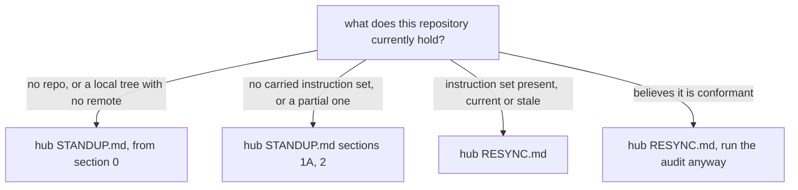

# Instructions for AI Coding Agents

**PlexCleaner** is a .NET 10 CLI utility that optimizes media files for Direct Play in Plex, Emby, and Jellyfin, converting containers to MKV, re-encoding incompatible codecs, managing tracks and language tags, verifying and repairing media, and monitoring folders for changes. It orchestrates external media tools (FFmpeg, HandBrake, MkvToolNix, MediaInfo, and 7-Zip) through CLI wrappers. It ships two release targets, a multi-arch Docker image on Docker Hub (`ptr727/plexcleaner`) and standalone executables attached to GitHub Releases, and consumers pull from Docker Hub or the GitHub releases on their own cadence. The repo also holds an xUnit test project (`PlexCleanerTests/`), optional process plugins (`Plugins/`), and a Python regression-test tooling subtree (`RegressionTests/`).

This file is the entry point every coding agent reads first, and it holds only three things: the bootstrap that says where the canonical rules live and which procedure to follow for the state this repository is actually in, the rules for managing context and delegation, which apply to every task, and a map of where every other rule lives. The rule text itself is in [`GOVERNANCE.md`](./GOVERNANCE.md), one section per topic. Code style lives in [`CODESTYLE.md`](./CODESTYLE.md) (a General section plus per-language sections for .NET, Python, and Shell, the language sections packaged as the `dotnet-codestyle`, `python-codestyle`, and `shell-codestyle` Skills), the CI/CD workflow contract in [`WORKFLOW.md`](./WORKFLOW.md), the architecture, processing pipeline, and design patterns in [`ARCHITECTURE.md`](./ARCHITECTURE.md), and the local verification, runbooks, and tool usage in [`OPERATIONS.md`](./OPERATIONS.md).

Treat this file and `GOVERNANCE.md` as authoritative for cross-cutting rules, and do not restate their rules elsewhere. A Skill that needs a rule's full text to work in isolation carries it as a generated include from the rule's home rather than as a copy, per the `skill-lifecycle` Skill, so the text cannot drift undetected. This project's own conventions and behavioral contracts live in the topical doc that owns them, [`ARCHITECTURE.md`](./ARCHITECTURE.md) for the processing pipeline and design patterns and [`CODESTYLE.md`](./CODESTYLE.md) for how the code is written, and **never** in [`.github/copilot-instructions.md`](./.github/copilot-instructions.md), because that file targets GitHub Copilot / VS Code specifically while the rest are agent-agnostic, so any rule a reviewer must honor has to live outside it to be provider-independent. A section of its own in this file is not the alternative. An undeclared section here is drift to reconcile rather than a local liberty. Copilot review *mechanics* are owned by `.github/copilot-instructions.md`, and `GOVERNANCE.md` "PR Review Etiquette" delegates them there explicitly. High-level summaries in other docs (for example the README's Contributing section) are allowed when they link back here, without duplicating the rules themselves.

## Fleet Bootstrap

This repository is governed by a shared template, and the canonical rules, machine-readable spec, and procedures live in `github.com/ptr727/ProjectTemplate`, the repository these rules call the hub. Fetch that repository before acting on anything about conformance, carried content, repository settings, or standing a repository up, because a carried copy here can be stale or absent and the hub is the only authority on what this repository is supposed to hold. This section is byte-locked across every repository in the fleet, so it reads identically wherever it is found, and it is the entry point whenever nothing else present says where the rules are.

Route by what this repository currently holds rather than by what it is expected to hold, since the two differ exactly when this section matters most.



- **No repository yet, or a local tree with no remote.** Follow the hub's `STANDUP.md` from section 0. That file is hub-only and deliberately not carried, because a repository needing it cannot be relied on to hold a current copy. Note that nothing in it creates the GitHub repository, which is an outward-facing write requiring explicit permission, so section 0A is the list handed to the maintainer before anything else starts.
- **A repository with no carried instruction set, or a partial one.** Carry the baseline per the hub's `STANDUP.md` sections 1A and 2, which resolve what this repository is owed from its declared types and workflow model. Absent files are not drift to re-vendor, they are a baseline that never arrived, and the two are fixed differently.
- **A repository with the instruction set, current or stale.** Follow the hub's `RESYNC.md`, which runs `AUDIT.md` end to end for the findings and then applies each one in an order that matters, since the rules govern what comes after them, a deletion must precede the re-vendor that would otherwise refresh the file, and only some findings are mechanically detectable at all. An audit that reports drift and stops is half the procedure.
- **A repository that believes it is conformant.** Run the audit anyway, because conformance asserted without a report is conformance nobody can check. The hub commits that report under its own `reports/`, since a report written by the repository it measures is a claim rather than evidence, so a session in the repository being audited fixes its own drift in its own repository, files its findings about the hub as issues, and leaves the report to a hub-side audit rather than opening a hub pull request to write its own. This is the same procedure as the case above and is listed separately only because it is the one most often skipped.

Three rules bound every path above. **Read the hub's `main` branch as ground truth**, since that is the promoted and gated state, and read `develop` only to detect divergence. **Reach the hub as a checkout of your own and fetch it immediately before reading it**, because a clone is whatever it last fetched rather than the branch it names, and work only in that checkout rather than in one that another task is using, per [`GOVERNANCE.md`](./GOVERNANCE.md) "Repository Boundaries and Write Safety" and "Hub-Hosted Tooling". And **the audit is read-only**: it produces a report and never edits the repository it measures, so a fix is a separate, reviewable change.

## Context and Delegation Discipline

An agent session is billed on the context it carries, not the work it does. Every request re-reads the whole accumulated context, so a token added early is paid for again on every request after it. A long session therefore bills its last task for every earlier one. Most of these are cost rules. None of these rules licenses doing less work, skipping verification, or shipping something unreviewed.

### Session Scope

- **One deliverable, one session.** A session covers one branch and one deliverable, and ends when that work merges. A multi-step task is one deliverable and stays in one session. Two unrelated tasks are two sessions even when they run back to back.
- **End a session at any of these, without being asked:** the branch changes, the pull request merges, or the next task is unrelated to the last. A review round is none of them. A loop still producing findings is the deliverable in progress, and a round count is not a reason to leave one open.
- **A session orchestrating dispatched work is an exception, and a narrow one.** Its deliverable is the run rather than any branch, so it spans many branches and many merges by construction, and ending it at the first dispatched merge would end the run. The triggers above land on each dispatched task instead, one branch and one deliverable each, which is this rule applied rather than waived. What keeps the exception narrow is that such a session holds no branch of its own and authors none of the work it dispatches, so the file context every other session accumulates is context it never takes on, and it re-derives each round's state from live sources rather than holding it, per "Re-derive state, do not carry it" below. A session that starts editing the files a dispatched task would have edited is an ordinary one again and ends on the triggers above.
- **Hand off in an issue, never in a scratch file and never in context.** Close a session by filing the next link in the handoff chain of the repository holding the work the next session resumes, which for a session that stayed in one repository is this one, and a session that spanned several names the others in the handoff's state section. A track is a lane of work named by a short slug, `default` where a session names none, and a track in use holds exactly one open issue carrying the `handoff` label. The track and the predecessor are recorded in the issue body rather than in its title, so a retitled or hand-edited issue still chains and a reader can tell which lane an open issue belongs to. The new link names its predecessor that way, a forward-link comment then goes onto that predecessor, and the predecessor is closed last, in that order, so a failure part way leaves a discoverable new issue rather than a closed chain with no successor. Each of those three is an outward-facing write, so the write-safety rules in `GOVERNANCE.md` "Repository Boundaries and Write Safety" bind all three exactly as they bind any other write, the identifier rule most of all, since the link a comment and a close target is read live in the same run rather than remembered. The chain needs the `handoff` label to be findable at all, so a repository not carrying it cannot host one until the fleet label set is applied there, which is a change to that repository's configuration rather than anything a handoff writes. A session that cannot file a link reports that it could not hand off and leaves the previous link open, whether it is stopped by a repository carrying no such label, by a write it may not make, or by anything else. That is the one alternative this rule allows to a track still in use, and it is a report rather than a file, because a report says the round's record is missing while a file claims to be it. A track whose work is complete is closed out instead, its last link carrying the outcome as a comment and closed with no successor, which leaves the track no longer in use rather than breaking its chain. A scratch file fails three ways the chain closes. It is not found where the next session looks. More than one candidate is found and nothing says which is current. And it holds no history, so a later round re-runs a path an earlier round already tried and already wrote down, which is the one thing a handoff exists to prevent. The handoff carries the next steps in priority order, the external blockers and internal dependencies among them, the state a resume re-reads rather than trusts, listed so the resume knows what to re-read, the account of parked decisions that `GOVERNANCE.md` "Communicating with the User" requires, what the last round did, what not to repeat, and what was learned. That section states the account whole, and it requires the session to present those decisions as well as record them. **The size rule is stated per section.** An entry earns its place by being specific enough to change a later session's behavior, a section ranks what it keeps and drops whatever does not meet that bar, and what belongs somewhere durable goes there and appears here as one line and a pointer, a defect as an issue, a rule as rule text, a lesson as governance prose. The parked-decision account keeps the count and the ranked questions one round can carry, and names every issue past those by number alone, which is what keeps a queue larger than one round inside this rule. A summary held in context is re-billed until the session ends, a scratch file is read only on the machine holding it, and a closed link stays readable from any machine to every session after it.
- **Re-derive state, do not carry it.** "This session already has the context" is the signal to split, not to continue. Context that has gone stale is worse than absent, because a file read hundreds of requests ago no longer describes the file.
- **Compaction is a fallback, not the strategy.** It restarts context from a floor and climbs again, where a fresh session starts from zero.

### Reading

- **Map a large file, then read one range.** For anything over about 200 lines, list the headings with `grep -n '^## '` first and read only the range the task needs. Read the section, not the file that contains it.
- **Prefer an in-place edit to a whole-file rewrite.** Rewriting a file bills its full content again on top of what the read already cost.

### Commands

- **Bound output at the source.** Write every command so its output is the answer, not the haystack: a `--jq` projection on an API call, a count or files-only flag on a search, a summary flag on a diff, an explicit cap on anything unbounded. A command whose output you then skim is a command that should have been narrower.
- **Keep a long query in a file, not in the command.** A heredoc re-typed on every call costs its own length in context each time, often more than the answer it retrieves.
- **Keep generated caches outside the checkout when the executor restricts writes.** Give each task a cache directory under a writable temporary root. Point tools such as uv and ruff there through their own cache variables. Never repurpose `HOME` or an agent's configuration directory to make a tool run.
- **Report an execution boundary separately from a check finding.** A denied path, network request, or Docker socket says the check did not run. Preserve that failure, then use the executor's approval mechanism for the required rerun. Request the narrowest reusable command prefix the executor supports. Report the rerun's result as the verification evidence.

### Delegation

- **Delegate exploration, keep judgment.** A subagent starts from an empty context and returns only its conclusion, so a wide search, a multi-file audit, or a "which of these is affected" question costs a fraction of the same work inline. Delegate when the finding compresses to a short answer, and stay inline when the intermediate detail drives the next edit.
- **Match the model tier to the judgment, not to the diff size.** Mechanical work (a known-shape edit repeated across files, an extraction, a status check, a lint fix) runs on the cheapest model that does it correctly, at the lowest reasoning effort that holds. State the tier in the delegation itself rather than accepting the default. A change to a gate, a ruleset, a release condition, or a carried governance section is a design change however small it looks.
- **Never tier down the seat holding the judgment.** Governance wording, spec logic, rulesets, repository visibility, and the decision to decline a review finding are fleet-wide and durable when wrong. Tier the subagents, not the main thread.
- **Brief a subagent so it never needs a governance file.** A subagent inherits no context, so anything it must honor has to be in its prompt. Reading `GOVERNANCE.md` to find out costs it the same tokens the main thread would have paid. Brief on this shape:

```text
Task: <the one question or edit, stated so the answer compresses>
Paths: <exact files or globs - never "find the relevant files">
Rules that bind this task: <the specific rules, quoted, not a pointer to a doc>
Return: <the shape of the answer - a list, a diff, a yes/no with evidence>
Bounds: <what not to touch, and what to do when a rule looks incomplete>
If a rule you were given does not cover what you find, stop and report it. Do not guess, and do not read a governance file to resolve it.
```

- **Wait in a background process, not in a poll loop.** A review or CI wait is a sequence of near-identical requests, each billed for whatever context it happens to carry. Run the wait as one backgrounded command rather than as a sequence of turns.
- **A wait separates three outcomes, and says which one it reached.** The condition was met, it has not been met yet, and the wait cannot reach it at all are three different results, and a backgrounded wait that emits nothing renders all three identically. Run the command once in the foreground and read its output before backgrounding it, because a wait is only as good as the command inside it, and an unsupported flag on the installed tool version exits non-zero with an empty stdout that every naive test reads as "nothing yet". Never let a fallback stand in for a failed command, since `|| echo '[]'`, `|| true`, and `2>/dev/null` convert an error into that same reading, which is the suppression the write-safety rules already forbid on a mutation. Make the wait emit on failure as loudly as on success, so silence means "still running" and nothing else, and bound it, so a condition that is never coming ends in a report rather than in another wait.
- **Never write a wait as an unbounded shell loop.** This is a prohibition rather than a preference. A loop that waits for something, with no bound anywhere in the command that runs it, is forbidden. That holds in a tool call, in a script, and in a brief handed to a subagent. The bound goes inside that command. The wait then says which of three things it found: the condition met, the bound reached, or the check itself failing. **Prefer the mechanism that already signals.** Where the dispatch mechanism reports a subagent's completion itself, polling that subagent's output file is a second channel. The answer is already on its way. **The agent that starts a wait owns the process it leaves.** A process a tool call leaves running survives the turn, the subagent, and the run that dispatched it. So a run that dispatched workers does not report itself done while it cannot say what it left running.

## Where the Rules Live

Every rule below is a level-two section of [`GOVERNANCE.md`](./GOVERNANCE.md) unless its row says otherwise. Read the section the task needs.

| Working on | Section |
| --- | --- |
| Why the rules are shaped this way | `Foundational Principles` |
| Recording a durable lesson, updating governance, or work here waiting on a fix in another repository | `Durable Knowledge and Self-Improvement`, surfaced at its decision moments by the `agent-conduct` Skill, and the section keeps the full rules |
| Any push, API mutation, comment, label, or merge, or which checkout the work happens in | `Repository Boundaries and Write Safety`, its task-isolation rule surfaced at the task-start moment by the `repo-worktree` Skill, and the section keeps the full rules |
| Quoting data into a comment, commit, test, or doc | `Representative Data in Agent-Authored Text` |
| Committing, signing, rebasing, force-pushing | `Git and Commit Rules`, packaged as the `git-commit-conventions` Skill |
| Branch choice, promotion, keeping branches in sync | `Branching Model`, packaged as the `branching-and-release-model` Skill |
| Releasing, version bumps, publishing | `Release Model`, packaged as the `branching-and-release-model` Skill |
| A live config repo rather than a code repo | `Operational Repositories`, packaged as the `branching-and-release-model` Skill |
| Onboarding a repo or running a conformance sweep | `Repository Onboarding and Conformance` (hub only, not carried). Standing up a new repo from a hub checkout is packaged as the `standup-a-repo` Skill, resyncing one already stood up the same way is `resync-a-repo`, and measuring a named repo against the fleet ground truth per `AUDIT.md` is `audit-a-repo`, all hub-context only |
| Running a fleet gate, the review digest, or the config script | `Hub-Hosted Tooling` |
| Running a lint or format check locally, or a lint tool missing from `command -v` | `Running the Linters Locally (Known-Working Invocations)` (hub only, not carried) |
| Running a test locally, or a test runner missing or failing to spawn | `Verification Discipline` |
| Writing a commit message or pull request title | `Pull Request Title and Commit Message Conventions`, packaged as the `comment-and-doc-style` Skill |
| Any prose, comment, doc, or line-ending change | `Documentation Style Conventions`, packaged as the `comment-and-doc-style` Skill |
| Proving work actually happened | `Verification Discipline`, surfaced at its decision moment by the `agent-conduct` Skill, and the section keeps the full rules |
| Editing rule text, a Skill, or any other content other repos carry | `Verification Discipline`'s carried-content rule, which asks nothing of the change itself, its passes being run by the `local-strict-review` Skill against the units a periodic sweep names and recorded by the hub-hosted `scripts/canonical_review.py` |
| Opening a pull request, or requesting, monitoring, answering, or closing a review | `PR Review Etiquette`, packaged as the `pr-review-conduct` Skill |
| Reviewing a pull request, patch, or change set | No section of its own: the `fleet-code-review` Skill, which routes to the applicable general, language, documentation, and workflow skills |
| Reporting progress or asking the user something | `Communicating with the User`, surfaced at its decision moments by the `agent-conduct` and `session-handoff` Skills, and the section keeps the full rules |
| Editing a workflow YAML file | `Workflow YAML Conventions`, surfaced with the full `WORKFLOW.md` contract by the `workflow-ci-contract` Skill, with that section keeping the style rules and `WORKFLOW.md` the contract |
| Choosing an OS, runtime, or toolchain target | `Supported Development Platforms` |
| The devcontainer | `Devcontainer` |
| Editor settings and tasks | `Editor and Tasks` |
| The About panel, description, or repo toggles | `Repository Details` |
| Where a file belongs in the tree | `Repository Layout` |

A row above naming no Skill, or naming one only for part of its section, is doc-only by decision rather than by omission, and the reason differs by row. `Foundational Principles` is rationale read once rather than a procedure. `Repository Boundaries and Write Safety` and `Representative Data in Agent-Authored Text` are always-on law that binds whether or not a Skill fires, which is why the boundaries row names `repo-worktree` only for the one moment in it narrow enough to surface, isolating into a worktree at task start, on top of that law rather than instead of it. The `gh-write-guard` hook and the host-wide instruction blocks maintained by the hub's own agent-safety installer, hub-local at `host-setup/agent-safety/`, are the boundaries section's mechanical layer, while the data section has none, since no pattern decides it. `Running the Linters Locally (Known-Working Invocations)` is hub-only, so a carrier reaches it in a hub checkout rather than surfacing it. `Verification Discipline` carries its Skills on its other two rows. And `Hub-Hosted Tooling`, `Supported Development Platforms`, `Devcontainer`, `Editor and Tasks`, `Repository Details`, and `Repository Layout` are short reference sections a task reads at the moment it touches their subject, each already routed to by the procedures and Skills that need it.

Some of the rules above are also packaged as Claude Code / opencode / Codex Skills, hand-authored at `.agents/skills/` in the hub (not a repo-relative link here, since that path is hub-local and not carried into every fleet repo), so they surface automatically instead of needing to be re-read every session. `scripts/` is hub-hosted and reached rather than carried, per "Hub-Hosted Tooling", so run the installer from a hub checkout: `python3 scripts/skills_install.py` (or the `.sh`/`.ps1` wrapper) once per machine, from `github.com/ptr727/ProjectTemplate`, installs them for every repo touched from that machine. `python3 scripts/skills_install.py --report`, also from a hub checkout, says whether this machine is current. A rule that keeps needing to be restated is a sign the install is missing or stale, not that the rule does not exist. Keeping a repo's own carried `.github/copilot-instructions.md` in sync with the hub, without losing that repo's own "Disproved Claims" ledger entries in the process, is `copilot-instructions-keeper`, a skill about maintaining that file rather than a rule extracted from it, since the file itself is read directly by the Copilot bot and stays fully intact everywhere it is carried. Checking, from inside this repo's own session with no operator watching, whether this repo and this machine are actually current against the hub is `check-this-repo`, new content rather than a rule extracted from a section, the counterpart to `resync-a-repo` that needs no standing hub checkout or named target beyond the repo the session is already in, even though its own check fetches a hub checkout to reach `scripts/skills_install.py`. Opening a pull request against a repository outside this fleet, one the maintainer does not control, follows a different workflow entirely, new content rather than a rule extracted from a section, packaged as `upstream-contribution-workflow` and independent of the target repo's own type or workflow model. Isolating a task into its own worktree before its first file edit, with the base-branch choice, the layout convention, and the cleanup mechanics, is `repo-worktree`, the task-start surface of the `Repository Boundaries and Write Safety` law, which keeps the rule. Writing the handoff that "Session Scope" above requires, and resuming from one, is `session-handoff`, new content rather than a rule extracted from a section, since deciding what actually earns a place in each of the sections that rule names is judgment rather than a shape. It carries `GOVERNANCE.md` "Communicating with the User" whole as a generated include, that being the parked-decision account the rule owes, and it names the hub's `scripts/handoff.py` for the chain's mechanics. Its widest trigger is the one that earns it, about to re-attempt something a previous round may already have tried, since a session that does not know a chain exists never goes looking for one. Creating, changing, or retiring one of these skills is itself packaged as `skill-lifecycle`, hub-context only, since `.agents/skills/` exists only in the hub and the generated plugin tree is never hand-edited.

Adding or changing a managed host tool is packaged as `add-host-tool`. It keeps the cross-platform contract, installer, documentation, test, and native-verification surfaces together.

Driving a pull request through its review loop, from a feature branch into `develop` and, when asked, on to a mergeable `develop -> main` promotion PR, disposing of every reviewer finding along the way per `pr-review-conduct`, is packaged as `drive-pr`, new content rather than a rule extracted from a section. Merging a ready promotion PR and dispatching the release it unblocks, refreshing this machine's installed Skills first when the repo is this hub, is `merge-and-release`, its own new-content package, invoked separately from `drive-pr` so the promotion merge and the release dispatch each keep their own explicit go-ahead. Working a whole open-issue backlog down by rounds, ranking the issues, grouping them so no two groups touch the same file, dispatching one subagent per group to drive its own pull request into `develop`, opening at most one `develop -> main` promotion pull request per round, and re-ranking from scratch afterwards because each round's reviews file new issues, is `backlog-burndown`, also new content rather than a rule extracted from a section. It orchestrates `drive-pr` rather than replacing it, and it scopes to the repository the session is in, and a fleet-wide issue sweep is a different request. Working the handoff chain with no maintainer present, a lean orchestrator dispatching one picker and one worker subagent per round, each worker merging only as far as the scope named at invocation and parking any handoff that meets a decision under the `blocked` label, is `unattended-handoff`, also new content, and its parked links return to the attended session `session-handoff` states.

Running one read-only, adversarial review pass against a branch's current diff against its target branch, full file context included, on the strongest model tier the session can reach, before a unit of PR-bound work is pushed toward a pull request or claimed done, is packaged as `local-strict-review`, new content rather than a rule extracted from a section. `drive-pr`, `pr-review-conduct`, and `agent-conduct` each reference it at the moment they already govern, rather than restating what it does. The rule itself lives in [`GOVERNANCE.md`](./GOVERNANCE.md) "Verification Discipline", the hub-hosted `scripts/local_review.py` is the engine that records a pass so a capture point can check one, and a repository carrying a `.husky/pre-push` hook enforces it at the push itself, the skill staying the primary and agent-agnostic layer with the hook a bypassable backstop under it. That skill carries a second pass under the same rule, over canonical content this repository authors and others carry, read one whole unit at a time rather than as a diff, because a diff-scoped read leaves the first real review of a rule to whichever repository carries it next, which is the one repository that cannot act on what it finds. That one is swept on a schedule rather than owed by a push, since owing it at every change cost more than the fleet chose to keep spending there, so a change that edits such content pushes and merges like any other. `scripts/canonical_review.py` is that pass's engine, and the units the pass has yet to reach are listed in the burn-down that engine's `report` renders from the hub's `reports/canonical-review.json`, not a repo-relative link here since that path is hub-local like the Skills tree above.
