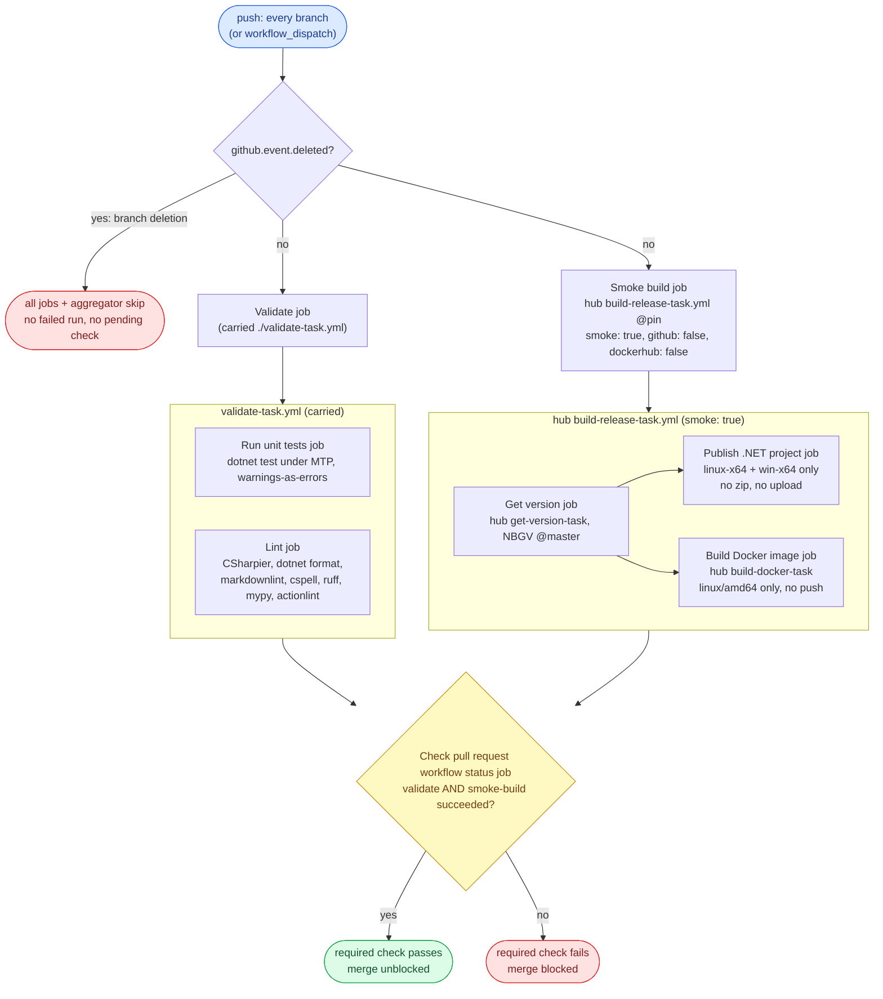
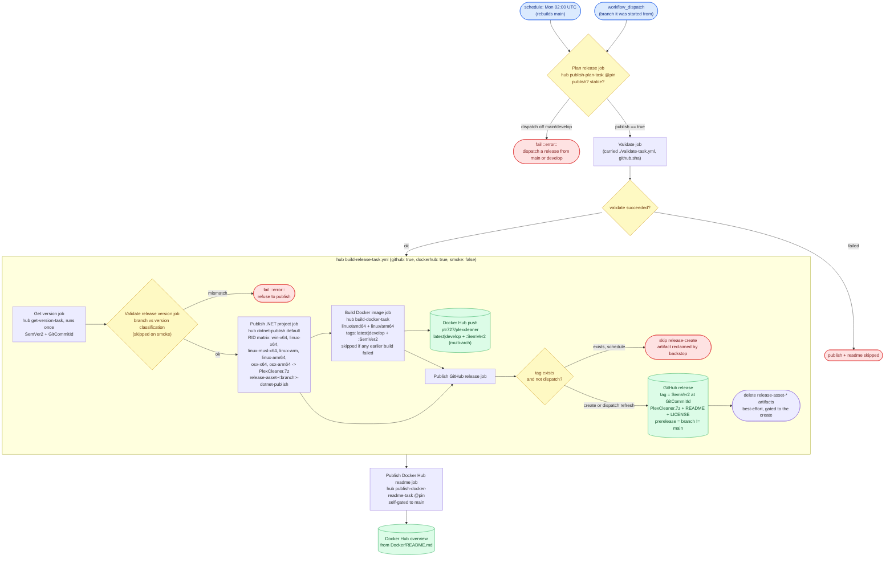
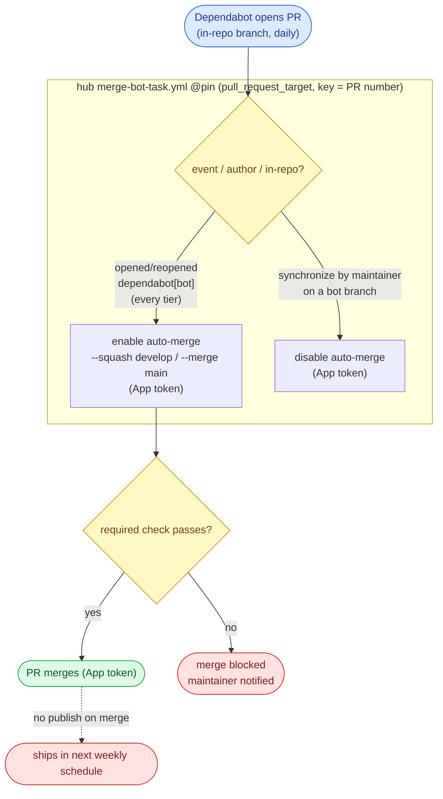

# WORKFLOW.md

The single guide for this repo's CI/CD **workflows** (GitHub Actions): **code style**, **architecture**, a
**behavioral contract** (expected inputs and outputs), and a **test methodology**. Source code style lives
in [`CODESTYLE.md`](./CODESTYLE.md). This file covers everything under
[`.github/workflows/`](./.github/workflows/).

It **describes required outcomes, not a required implementation.** A workflow is correct when it satisfies
the contract (section 4), whatever shape its YAML takes. Section 2 keeps workflows legible. Section 3 is
the model. Section 4 is what they must *do*. Sections 5 and 6 are how to verify it and the configuration it
assumes. Each guarantee names the **failure it prevents**, so the reason survives a reimplementation.

## 0. The model at a glance

PlexCleaner ships **two targets**: standalone **executables** (a multi-runtime `PlexCleaner.7z` attached to
a GitHub release) and a **multi-arch Docker image** (Docker Hub). Two workflows do the work:

- **CI** runs on **push to every branch**: it validates (unit tests + lint) and smoke-builds both targets,
  publishing nothing. A pull request merges only when its required check is green.
- **The publisher** runs on a **weekly schedule and on manual dispatch** - never on a merge, and builds **one
  branch per run** (the trigger ref). The **schedule** rebuilds **`main` only** (stable release + `latest`
  image, plus a refreshed `ubuntu:rolling` Docker base for security updates). A **dispatch** publishes the
  branch it is started from: from `main` -> stable / `latest`, from `develop` -> prerelease / `develop`. Merges
  accumulate; the next scheduled run ships main's, and a develop release is cut by dispatching from `develop`.

There is no publish-on-merge, no per-push release, and no two-branch matrix - building only the trigger branch
keeps `github.ref` aligned with the branch being versioned. A maintainer dispatches to release on demand.
Dependabot pull requests merge themselves once their checks pass.

The **build, publish, plan, merge-bot and Docker-Hub-overview jobs are thin callers of hub-hosted reusable
tasks** in `ptr727/ProjectTemplate`, reached by a commit-SHA `uses:` pin that Dependabot bumps, per that
repo's `docs/reusable-workflows.md`. This repo carries no copy of them. The one task still carried here is
`validate-task.yml`, because the hub's own unit-test step is the VSTest invocation that
Microsoft.Testing.Platform rejects on the .NET 10 SDK (ptr727/ProjectTemplate#1088); it converges once that
lands.

### Glossary

- **Entry workflow** - has `push` / `schedule` / `workflow_dispatch` triggers. The orchestrator that an event or
  a person starts.
- **Reusable workflow (task)** - a `workflow_call` workflow invoked through a `uses:` reference, never
  triggered directly. File ends in `-task.yml`. A hub task is reached by an owner-scoped, SHA-pinned `uses:`;
  a carried one by a local `./` path.
- **Target** - one shipped output: the **executable** (the hub's `dotnet-publish` default, driven by
  `dotnet_publish_project`) or the **Docker image** (the hub's `build-docker-task.yml`, driven by
  `docker_image`). The hub's `build-release-task.yml` orchestrates both plus the GitHub release.
- **Hook** - an optional `.github/actions/<name>/action.yml` a hub task prefers over its own default. This
  repo carries none: the hub's `dotnet-publish` and `docker-prepare` defaults already produce the 7-runtime
  `PlexCleaner.7z` and the `./Docker/Dockerfile` build this repo needs.
- **Smoke build** - a CI build that compiles and packs a target to prove it still ships, publishing and
  uploading nothing. Driven by a `smoke: true` input.
- **Release-asset seam** - a target attaches files to the GitHub release by uploading a workflow artifact
  named `release-asset-<branch>-<target>`; the `github-release` job collects every `release-asset-<branch>-*`
  by pattern. The executable target uses it (the `PlexCleaner.7z`); the Docker target pushes to Docker Hub
  and attaches nothing.
- **Transfer artifact** - a workflow artifact handing a file between jobs of one run. The durable copy lives
  on the GitHub release / Docker Hub.
- **Shipped input** - a file that changes what is shipped: the app source (`PlexCleaner/**`), the Docker
  build context (`Docker/**`), the version floor (`version.json`), or the build configuration
  (`Directory.Build.props`). Dependency bumps (`Directory.Packages.props`) and Actions bumps are **not**
  shipped inputs - they ship in the next weekly publish, not on merge.
- **GitHub App token** - a short-lived installation token from `actions/create-github-app-token`, minted
  from the App credentials (`CODEGEN_APP_CLIENT_ID` / `CODEGEN_APP_PRIVATE_KEY`). The merge-bot uses it, not
  `GITHUB_TOKEN`: a `GITHUB_TOKEN` push does not trigger downstream workflows, and that token is read-only on
  Dependabot pull requests.

## 1. Purpose and how to use this document

- **Contract, not implementation.** Conform to the *outcomes* in section 4 and the *architecture* in section
  3. Job names and file layout may vary; the input/output behavior may not.
- **"Operational" - the one definition.** The repo is **operational** when every applicable section-4
  guarantee holds, every applicable section-5B scenario's observed output equals its expected output
  (corroborated by a 5C live probe where a live signal exists), and the section-6 configuration is in place.
  Anything else is **not operational**.
- **Defect vs N/A.** An item is **N/A** only when this repo has no such concern (e.g. a fork-PR scenario,
  since a fork cannot push here). A construct required by an applicable guarantee but absent is a **defect**.
- **Default branch is `main`.** Guarantees say "default branch" portably. This repo writes the literal `main`
  in the prerelease expression and the release-version backstop, and the anchored `^refs/heads/main$` in
  `version.json`'s `publicReleaseRefSpec`.

## 2. Workflow style conventions

Legibility rules. Necessary but not sufficient: a perfectly styled workflow can still violate section 4.

- **Action pinning.** Pin every action to a commit SHA with a trailing `# vX.Y.Z` comment. Use `# vX` only
  when the upstream floating major tag has no specific patch SHA. A tool an action *installs* (e.g. the
  actionlint binary behind `raven-actions/actionlint`) is not a `uses:` ref and is left unpinned to track latest.
- **Hub-task pinning.** A `uses:` naming a hub-hosted reusable workflow carries the same commit SHA plus
  `# <release-tag>` comment as any action, so a hub change never reaches this repo until Dependabot proposes
  the bump and the required checks pass on it.
- **Filename.** Reusable workflows end in `-task.yml`; entry workflows end in what they do
  (`-pull-request.yml`, `-release.yml`). A `-task.yml` is `uses:`-d, never triggered directly.
- **Workflow `name:`.** Reusable names end in **"task"**, entry names in **"action"**.
- **Job and step `name:`.** Every job `name:` ends in **"job"**, every step `name:` in **"step"**, the
  aggregator included (`Check pull request workflow status job`). A job name also bound as a ruleset
  required-check `context:` is codified in the hub's `repo-config/` payloads and changed only **in lockstep**
  with the live ruleset.
- **Concurrency.** Every entry workflow declares a `concurrency` group. CI uses
  `group: '${{ github.workflow }}-${{ github.ref }}'`, `cancel-in-progress: true`. The publisher overrides
  it: a ref-independent group with `cancel-in-progress: false`, so two publishes never overlap (a schedule and
  a manual dispatch, or back-to-back dispatches against the shared Docker tags) and none is cancelled
  mid-release. The merge-bot also overrides it: it keys on the PR number with `cancel-in-progress: false`
  so each PR's events run to completion in order.
- **Shells.** Every multi-line bash `run:` starts with `set -Eeuo pipefail`.
- **Conditionals.** Multi-line `if:` uses the folded scalar `if: >-`.
- **Boolean inputs.** A boolean used by both `workflow_call` and `workflow_dispatch` is declared in both
  trigger blocks and compared against `true` and `'true'`.
- **Reusable-workflow permissions.** Job-level `permissions:` are validated before `if:`, so even a skipped
  job needs valid permissions. Grant least privilege; a callee's extra scope is granted by the caller.
- **Allowlist `success` and `skipped` explicitly** across an optional dependency: use
  `(needs.X.result == 'success' || needs.X.result == 'skipped')`, not `!= 'failure'`.
- **Line endings.** Workflow YAML is **LF**, which is the repo-wide `[*]` default in
  [`.editorconfig`](./.editorconfig) and the `* text=auto eol=lf` normalization in
  [`.gitattributes`](./.gitattributes), so it needs no pin of its own. Preserve on every edit.

## 3. Architecture

### Two workflows: CI on push, publishing on schedule/dispatch

CI ([`test-pull-request.yml`](./.github/workflows/test-pull-request.yml)) and the publisher
([`publish-release.yml`](./.github/workflows/publish-release.yml)) are separate workflows with separate
concurrency, so they never race. CI re-tests every pushed tree and never publishes; the publisher releases
on its own cadence and never runs on push. *Prevents a merge from silently cutting a release, and a CI run
from racing a publish on the same ref.*

### The publisher builds one branch: the trigger ref

A publish builds exactly **one** branch - the run's trigger ref. The **schedule** always runs on the default
branch, so it rebuilds `main`; a **dispatch** runs on the branch it is started from (`main` or `develop`). The
single `publish` job passes `github.sha` as `ref` and `github.ref_name` as `branch`, so the branch built,
versioned, and tagged is always the run's own ref, pinned to the exact commit the run started from - a push
landing mid-run is never released unvalidated. *No matrix and no cross-branch ref mixing - `github.ref` is the
branch being published.* The `plan` job is the one gate: a dispatch from anything but `main` or `develop`
fails loudly rather than running a silent no-op, so a mistyped release attempt is visible. To release
`develop`, dispatch the workflow from `develop`.

The run's ref **is** the built branch, so the carried `uses: ./.github/workflows/validate-task.yml` resolves
from that same branch's commit - a `develop` dispatch runs develop's own gate definition, and the schedule
runs main's. A hub task resolves from its own pinned commit instead, which is the point of the pin: the
release chain a branch builds with is the one its `uses:` names, not whatever the hub happens to hold today.

### Versioning: compute once, thread everywhere

NBGV runs once (in the hub's `get-version-task`, reached from inside `build-release-task`), classifying from
`github.ref` (see below), and its outputs (`SemVer2`,
`GitCommitId`, the assembly versions) thread to every consumer via `outputs:` / `needs:`. A build job may check
out a specific commit to compile it, but consumes the threaded version. `main` (the public ref,
`publicReleaseRefSpec = ^refs/heads/main$`) builds a clean `X.Y.<height>`; every other branch a prerelease
`X.Y.<height>-g<sha>`. *Keeps each target's built version and the release tag in agreement.*

NBGV classifies `publicReleaseRefSpec` from the `GITHUB_REF` environment variable. Because the publisher builds
the **trigger ref** (one branch per run), `GITHUB_REF` already equals the branch being versioned - a schedule or
`main` dispatch classifies as public (clean `X.Y.<height>`), a `develop` dispatch as prerelease
(`X.Y.<height>-g<sha>`) - so no `GITHUB_REF` override is needed. (`IGNORE_GITHUB_REF` is only for matrix
publishers that build a non-trigger branch.) The release-version gate (D2.2) catches any misclassification.

### Validate at entry

A run that carries a cross-input invariant asserts it once with `::error::` before any build, not after one.
The hub release task's `validate-release` job is that gate: `main` must not carry a prerelease suffix, and
every other branch must. Downstream jobs `needs:` it. The `plan` job is the entry gate one level up, deciding
`publish` and `stable` once for every job in `publish-release.yml`.

### Fast CI feedback, head-resolved

CI runs on push to every branch, so GitHub head-resolves the carried `./.github/workflows/validate-task.yml`
from the pushed head: a pull request that edits the gate tests its own copy. CI validates (`unit-test` +
`lint`) and smoke-builds both targets through the hub release task with `smoke: true`, uploading and pushing
nothing. One aggregator job, the ruleset-bound required check, gates the merge. A branch-deletion push
(all-zeros `github.sha`) is skipped by a `!github.event.deleted` guard on every job, so a deletion never runs a
failing build. The publisher runs the **same** `validate-task` against the branch it publishes (the run's ref
is that branch), so the CI gate and the publish gate are the identical definition applied to the same tree. A
hub-task bump is itself a Dependabot pull request, so the new pin is smoke-built on its own branch before it
can merge.

### The two-target release seam

The hub's `build-release-task` versions once, then builds the executable and Docker targets and creates the
GitHub release. A target attaches release files only through the `release-asset-<branch>-*` artifact seam, so
the tag-the-commit + create-the-release logic names no build job and is reusable as-is. The executable target
publishes the multi-runtime `PlexCleaner.7z` through the seam, named for the project file this repo passes as
`dotnet_publish_project`; the Docker target pushes multi-arch tags straight to Docker Hub (`latest` for main,
`develop` for develop, plus `:SemVer2`) and attaches no asset. The Docker Hub repository overview (a trimmed
[`Docker/README.md`](./Docker/README.md)) is its own `publish-docker-readme` job reaching the hub's
`publish-docker-readme-task`, so the overview publishes once per release rather than once per image build; the
task gates itself on `main`, since Docker Hub does not read the GitHub README and the overview has no
per-branch content.

### Resource lifecycle

Workflow artifacts are an intra-run handoff; the durable copy lives on the GitHub release / Docker Hub. Every
`upload-artifact` sets `retention-days: 1` so a run reclaims its artifacts even if a later step skips. The
run's artifact set is never blanket-deleted.

### Self-sufficiency: automatic updates

Every Dependabot pull request, any ecosystem and any tier including **semver-major**, auto-merges once the
required checks pass - the checks are the gate, not the version bump. This includes the hub-task `uses:` pins,
which Dependabot tracks as GitHub Actions dependencies, so the release chain advances the same way an action
bump does. A merged bump does not itself publish - it ships in the next weekly publish. There is no codegen
and no upstream-version tracker. A person steps in only for a breaking change (a red check) or to dispatch a
release.

### Flow diagrams

Three diagrams trace the architecture above: the pull-request gate, the schedule/dispatch publisher, and
the bot automation. They depict the same outcomes that the section 4 contract specifies, drawn from the workflow YAML; if a
diagram and a guarantee disagree, one of them is a defect. Triggers are blue, gates yellow,
durable/published outputs green, and stop/skip outcomes red.

**Pull request (CI) - `test-pull-request.yml`.** Every push head-resolves the reusable tasks, runs the
validate gate and a non-publishing smoke build of both targets, and a single aggregator produces the
ruleset-bound required check (D1, D6).

**Publish - `publish-release.yml` -> `build-release-task.yml`.** A weekly schedule (rebuilds `main`) or a
dispatch on the started branch validates, versions once with NBGV, gates on the branch matching that version's
classification, builds the per-RID executable 7z and the multi-arch Docker image, then cuts the GitHub release
and pushes to Docker Hub (D2, D3, D4). Both output sinks are shown.

**Automation - Dependabot + merge-bot.** Dependabot opens in-repo bot PRs; the merge-bot enables auto-merge
on open (squash on `develop`, merge on `main`) for every tier, and disables it on a maintainer push. There
is no codegen here; a merged bump does not publish - it ships in the next scheduled run (D8).

## 4. Behavioral contract - expected outcomes

Each is a **MUST**, stated as input -> output plus the failure it prevents.

### D0 - Architecture

- **D0.1 CI is one run, one branch.** Input: any push. Output: `test-pull-request` builds/validates exactly
  `github.ref_name` and publishes nothing. *Prevents cross-branch ref mixing in CI.*
- **D0.2 The publisher builds one branch: the trigger ref.** Output: the `publish` job passes `github.sha` as
  `ref` and `github.ref_name` as `branch`, so it checks out, versions, and tags exactly the commit the run
  started from on the run's own branch (the schedule's default branch, or a dispatch's branch). No matrix; the
  `plan` job decides `publish` once and every other job gates on `needs.plan.outputs.publish == 'true'`.
  *Prevents cross-branch ref mixing - `github.ref` is the branch being published.*
- **D0.4 The build and publish chain is hub-hosted, reached by pin.** Output: `plan`, `publish`,
  `publish-docker-readme`, the smoke build, and the merge-bot each name a `ptr727/ProjectTemplate` reusable
  workflow at a commit SHA with a release-tag comment; no copy of any of them is carried here. The one
  carried task is `validate-task.yml`. *Prevents the fleet's release chain drifting per repo, and prevents a
  hub change reaching this repo without a bump pull request that the required checks gate.*
- **D0.3 One version, threaded.** Output: NBGV runs once, every consumer reads it via
  `needs:` outputs; no consumer recomputes it. *Allowed:* checking out a specific commit to compile it, and
  recording the built commit as the release `target_commitish`. *Prevents a target's version diverging from
  its tag.*

### D1 - CI fast feedback

- **D1.1 Every push validates and smoke-builds both targets.** Output: on any push, the `validate` job (the
  carried `validate-task`) and `smoke-build` (the executable + Docker targets through the hub's
  `build-release-task` with `smoke: true`) run, no paths filter. *Prevents a reusable-workflow, a hub-pin bump,
  or a build break shipping untested.*
- **D1.2 Unit tests always run.** Output: `validate-task`'s `unit-test` job runs `dotnet test` (build with
  `TreatWarningsAsErrors`, so analyzer/style warnings fail here). [`global.json`](./global.json) opts the run
  into Microsoft.Testing.Platform, which the .NET 10 SDK requires of a test project carrying
  `Microsoft.Testing.Platform.MSBuild`, and `--coverlet --coverlet-output-format cobertura` drives
  `coverlet.MTP` to emit the Cobertura XML the Codecov upload reads.
- **D1.3 Lint enforces the editor checks in CI.** Output: `validate-task`'s `lint` job runs CSharpier check,
  `dotnet format style --verify-no-changes`, `markdownlint-cli2`, `cspell` on the user-facing docs (README,
  HISTORY), `ruff` and `mypy` over the `RegressionTests` Python tooling, `actionlint` (which shellchecks every
  `run:`), and `editorconfig-checker`. Same checks the editor and the Husky hook run.
- **D1.4 Smoke never publishes and never uploads.** Output: a smoke build compiles/packs both targets but
  makes no GitHub release, no Docker push, no artifact upload. Every publish step is gated `!smoke`. The
  Docker Hub login is **not** gated: smoke logs in too, for higher pull/cache-read rate limits, so it does
  require the Docker Hub secrets (present in both the Actions and Dependabot stores). Fork safety rests on
  forks being unable to push here - they trigger no run and gate no required check, not on the absence of
  credentials.
- **D1.5 One required aggregator gates merge.** Output: a single aggregator job must **succeed** (not merely
  "not fail"), `needs:` `validate` and `smoke-build`, and blocks on any non-success. Its name is
  ruleset-bound (D6.2) and must not be renamed. *Prevents a defect merging unverified.*

### D2 - Validation at entry

- **D2.1 Validate before publishing.** Output: a dedicated job/step asserts each cross-input invariant and
  fails fast with `::error::` before a publish; downstream jobs `needs:` it.
- **D2.2 Branch matches version classification.** Input: a real (non-smoke) publish run. Output: the dedicated
  `validate-release` entry job fails loudly if `main` carries a prerelease suffix **or** a non-`main` branch
  carries none. It strips `+buildmetadata` before testing for the prerelease `-` (only a core/prerelease `-`
  counts), and it is skipped on smoke (a detached PR head always versions as prerelease). *Prevents a develop
  build published as the stable `latest`, a develop leg classified public, and a build-metadata false positive.*

### D3 - Versioning and classification

- **D3.1 NBGV runs once, threaded.** Output: NBGV runs once, classifying from the checked-out branch; no
  consumer re-invokes it. The run builds the trigger ref, so `GITHUB_REF` already matches the branch being
  versioned and NBGV classifies it correctly (no override needed).
- **D3.2 `main` = stable, others = prerelease.** Output: `main` -> `X.Y.Z`, any other branch ->
  `X.Y.Z-g<sha>`. The release-version backstop and the GitHub-release `prerelease` expression name `main`;
  `publicReleaseRefSpec` is `^refs/heads/main$`.
- **D3.3 Version floor + git height.** Output: `version.json` sets the major.minor floor, NBGV appends the
  git height as the patch, never bumped on a cadence. *(Who raises the floor and when is a human-process rule
  in `GOVERNANCE.md` "Release Model".)*

### D4 - Release / publish

- **D4.1 Publish only on schedule or dispatch - never on push.** Output: `publish-release` triggers are
  `schedule` (weekly) and `workflow_dispatch` only. There is **no `push` trigger** and no `PUBLISH_ON_MERGE`
  variable. A merge does not publish. The hub `plan` task refuses a dispatch from anything but `main` or
  `develop` with an `::error::`, so a stray dispatch fails visibly rather than passing as a silent no-op.
  *Prevents per-merge release churn, a blind publish-on-merge, and a mistyped release attempt reading as
  success.*
- **D4.2 A publish builds the one trigger branch in full.** Output: the run builds the executable + Docker
  targets and creates the GitHub release for `github.ref_name` - the schedule rebuilds `main` (stable /
  `latest`); a dispatch publishes its own branch (`main` stable / `latest`, `develop` prerelease / `develop`).
  *Prevents a half-published release set and cross-branch ref mixing.*
- **D4.3 Tag the built commit.** Output: the release `target_commitish` is the run's `GitCommitId` - the commit
  NBGV versioned - never a branch name or a separately re-resolved ref. *Prevents the tag landing on the wrong
  commit.*
- **D4.4 Release contents and flag.** Output: each release is a tag on the built commit plus the auto source
  zip, README, and LICENSE, with the multi-runtime `PlexCleaner.7z` attached via the `release-asset-*` seam.
  The GitHub-release `prerelease` boolean is `inputs.branch != 'main'`. The Docker target attaches no asset;
  it pushes `latest`/`develop` + `:SemVer2` multi-arch tags to Docker Hub.
- **D4.5 No-op republish.** Input: a weekly re-run whose version is unchanged (no new commits). Output: the
  release-create step is skipped when the tag already exists (refreshed only on `workflow_dispatch`), while
  the Docker push still runs - re-pushing the same tags refreshes the base image. The paired transfer-artifact
  delete is gated to the consumer, so the `retention-days: 1` backstop reclaims it. *Prevents duplicate
  releases while still refreshing the image.*
- **D4.6 Publish is tested as built.** Output: `publish-release.yml`'s own `validate` job runs the same
  carried `validate-task` against `github.sha` before the `publish` job it `needs:`, so a failing test or lint
  blocks the release. The run's ref **is** the published branch, so that task definition resolves from that
  branch - it is the identical definition CI runs on the same tree. *Prevents publishing a tree that would
  fail the CI gate.*
- **D4.7 Docker publishing authenticates with Docker Hub credentials.** Output: the Docker target logs in via
  `docker/login-action` with `DOCKER_HUB_USERNAME` + `DOCKER_HUB_ACCESS_TOKEN` and pushes with
  `docker/build-push-action`; the `publish-docker-readme` job pushes the overview with the same credentials.
  There is no NuGet/OIDC publishing in this repo, so `enable_nuget` and `enable_pypi` are both `false`.
  *Prevents a missing-credential publish failure.*
- **D4.8 Branch-scoped Docker buildcache.** Output: the Docker build reads both branches' registry caches
  (`buildcache-main`, `buildcache-develop`) and writes only its own branch's cache, only when pushing, so a
  `main` and a `develop` publish never overwrite each other's cache. *Prevents one branch's publish destroying
  the other's cache hit-rate.*
- **D4.9 A build failure blocks every publish target.** Input: a real publish where one build fails. Output:
  nothing publishes. `github-release` needs both builds, so a failed build skips it (no tag, no release), and
  the Docker push is the terminal registry push, so `build-docker` needs the publish jobs before it and guards
  with `!failure() && !cancelled()`: a failed build skips it (no image, no push), while a target skipped by its
  own `enable_*: false` does not. `publish-docker-readme` needs `publish`, so a failed release never refreshes
  the overview. *Prevents a half-published release set where the image ships without the executable, the tag
  lands without the image, or the overview advertises a release that never shipped.*

### D5 - Resource cleanup

- **D5.1 Retention backstop.** Every `upload-artifact` sets `retention-days: 1`.
- **D5.2 Transfer artifacts consumed by pattern.** The `github-release` job collects `release-asset-<branch>-*`
  by glob, so adding/removing a file-producing target needs no release-job edit.
- **D5.3 Never blanket-delete.** Cleanup MUST NOT enumerate and delete the run's whole artifact set.
- **D5.4 Delete at the point of consumption, gated to the consumer, best-effort.** The `github-release` job
  deletes the `release-asset-<branch>-*` artifacts by exact pattern once they are attached to the release,
  under the **same** condition as the release-create step - so a no-op re-run that skips the create also skips
  the delete, and the `retention-days: 1` backstop reclaims those artifacts instead. The step is
  `continue-on-error`, tolerates a failed listing, and deletes every matching id. It needs `actions: write`,
  granted by the caller, since the hub task declares no job-level `permissions:` of its own
  (`publish-release.yml`'s `publish` job grants `contents: write` and `actions: write`). *Prevents transfer artifacts accumulating
  against the storage quota, freshly built assets being deleted on a no-op re-run, and a cleanup hiccup
  reddening a job whose publish succeeded.*

### D6 - Self-testing workflows

- **D6.1 A change is testable on its own branch.** Output: a workflow or build change is exercised by CI on
  the branch that introduces it, no dependency on reaching `main` first. A hub-pin bump is a change like any
  other: the branch carrying the new pin smoke-builds against it before it can merge.
- **D6.2 Head-resolution, single producer, fork exception.** Output: CI runs on `push` to every branch so the
  carried `./...` gate resolves from the head, and the aggregator's ruleset-bound `context:` is produced by
  that push run as the sole producer of that name. Dependabot PRs are in-repo branches, validated the same
  way. A fork cannot push, so it has no run and is validated by maintainer action - the one exception.
  *Prevents a dual-producer context race and a false self-test claim for forks.*

### D7 - Concurrency, permissions, safety

- **D7.1 The publisher does not cancel mid-flight.** Output: ref-independent group, `cancel-in-progress:
  false`. CI uses the `...-${{ github.ref }}` group with `cancel-in-progress: true`; the merge-bot keys on PR
  number (D8.1).
- **D7.2 Skipped jobs still need valid permissions.** Output: every reusable job runs under valid least-privilege
  `permissions:`; a callee's extra scope is granted by the caller.
- **D7.3 Boolean inputs both forms.** Declared in both trigger blocks, compared against `true` and `'true'`.

### D8 - Bots and automation

- **D8.1 Merge-bot.** Output: `merge-bot-pull-request.yml` is a thin caller of the hub's `merge-bot-task`,
  running on `pull_request_target` with `permissions: {}` at the caller, since every write in the task uses
  the App token. The task merges the PR by URL without checking out its code, enables auto-merge on
  `opened`/`reopened`, squashes on `develop` and merge-commits on `main` by the PR's base ref, and disables
  auto-merge when a maintainer pushes to a bot branch. Concurrency keyed on PR number. This repo passes no
  `rules` or `delete-branch` input: it has no tracker branch outside the task's built-in codegen and
  upstream-version pairs, and auto-delete-on-merge stays off.
- **D8.2 Dependabot auto-merges on green, every tier.** Output: every Dependabot PR, any ecosystem and any
  tier including semver-major, auto-merges once the required checks pass - the checks are the gate, not the
  version bump. A failing check blocks the merge. A merged bump does **not** itself publish (dependencies are
  not shipped inputs); it ships in the next weekly publish.
- **D8.3 No codegen / upstream-version automation.** This repo opens no App pull requests of its own, so the
  hub task's `merge-app` job is inert here and only its `merge-dependabot` and
  `disable-auto-merge-on-maintainer-push` jobs ever act.

### D9 - Style, static, and dropped workflows (see section 2)

- **D9.1** Every action and every hub-task `uses:` SHA-pinned with a version comment (sole exception:
  `dotnet/nbgv@master`, inside the hub's own task); an installed-tool version (e.g. the actionlint binary) is
  left unpinned to track latest.
- **D9.2** File/workflow/job/step names follow the suffix rules; a ruleset-bound `context:` name moves only in
  lockstep with the hub's `repo-config/` payloads.
- **D9.3** Bash `run:` blocks start `set -euo pipefail`; multi-line `if:` uses `>-`.
- **D9.4** Line endings follow `.editorconfig`.
- **D9.5 No decorative / dropped workflows, and no carried copy of a hub task.** No date-badge
  (`build-datebadge-*`), no tool-versions task, no `PUBLISH_ON_MERGE` variable, no `dorny/paths-filter`. A
  local `build-release-task.yml`, `build-docker-task.yml`, `build-executable-task.yml` or
  `get-version-task.yml` is likewise a defect: those are hub-hosted and reached by pin. Their presence is a
  defect to remove.
- **D9.6** Style is enforced in CI by the `lint` job (D1.3), from the same config files the editor and Husky
  hook use.

### D10 - Repository configuration

- **D10.1 Required configuration is present.** Output: the secrets, branch rulesets, and repository settings
  section 6 lists are all in place. The detail and validation are in section 6; the audit is 5D.

## 5. Test methodology

### 5A. Static audit (no execution)

Read the workflow files plus `version.json` and assert the fact behind each applicable guarantee with a
`file:line` citation:

- **D0:** CI has no branch matrix; the publisher's single `publish` job passes `github.sha` as `ref` and
  `github.ref_name` as `branch` and gates on `needs.plan.outputs.publish == 'true'`; NBGV invoked once, every
  other consumer reads it via `needs:`; the run builds the trigger ref so `GITHUB_REF` matches the versioned
  branch; every hub-task `uses:` is an owner-scoped `ptr727/ProjectTemplate/...@<sha> # <tag>` and no
  `build-release-task.yml`, `build-docker-task.yml`, `build-executable-task.yml` or `get-version-task.yml`
  exists under `.github/workflows/`.
- **D1:** CI runs on `push` with no paths filter; `validate` + `smoke-build` (both targets, `smoke: true`)
  run; every build `upload-artifact` is gated `!smoke`; `global.json` declares
  `test.runner = Microsoft.Testing.Platform` and the unit-test step passes `--coverlet
  --coverlet-output-format cobertura`; `lint` runs CSharpier, `dotnet format style`, markdownlint, cspell on
  README/HISTORY, ruff, mypy, actionlint, editorconfig-checker; the aggregator `needs:` both and blocks on
  non-success.
- **D2:** the hub task's `validate-release` job runs before the build jobs and they `needs:` it; it checks
  both arms (main without a prerelease `-`, every other branch with one), strips `+buildmetadata`, self-skips
  on smoke; `publish-release.yml`'s own `plan` job resolves `publish`/`stable` once and every later job gates
  on it.
- **D3:** `main` appears in the release-version gate and the `prerelease` expression; `publicReleaseRefSpec` is
  `^refs/heads/main$`.
- **D4:** `publish-release` triggers are `schedule` + `workflow_dispatch` only (no `push`, no
  `PUBLISH_ON_MERGE`); the single `publish` job gates on `needs.plan.outputs.publish == 'true'` and passes
  `github.sha` as `ref` and `github.ref_name` as `branch`, with `dotnet_publish_project` naming
  `./PlexCleaner/PlexCleaner.csproj` and `docker_image` naming `ptr727/plexcleaner`, `enable_nuget` and
  `enable_pypi` both `false`; `target_commitish` is `GitCommitId`; the `prerelease` boolean
  `== (inputs.branch != 'main')`; the executable attaches `PlexCleaner.7z` via `release-asset-*`; the Docker
  job logs in with `DOCKER_HUB_*` and pushes `latest`/`develop` + `:SemVer2`; release-create gated
  `exists == false || workflow_dispatch`; Docker buildcache is branch-scoped and write-gated on push; the
  `publish-docker-readme` job passes `repositories: '["ptr727/plexcleaner"]'` and the task self-gates to
  `main`.
- **D5:** every upload sets `retention-days: 1`; the release job collects `release-asset-<branch>-*` by
  pattern and deletes those same artifacts by pattern under the release-create condition, `continue-on-error`;
  the caller grants `actions: write`; no blanket artifact delete.
- **D6:** CI is `push` on every branch; the aggregator context has exactly one producer; no
  `pull_request`-triggered fallback; the smoke build resolves the hub release task from the pin the branch
  itself carries.
- **D7:** the publisher group is ref-independent with `cancel-in-progress: false`; the merge-bot keys on PR
  number; CI uses the standard group; reusable jobs declare permissions.
- **D8/D9:** the merge-bot is a thin caller of the hub task, runs on `pull_request_target` with
  `permissions: {}`, keyed on PR number; Dependabot auto-merge covers every tier; no date-badge,
  tool-versions, `PUBLISH_ON_MERGE`, or `dorny/paths-filter`; every action and hub-task `uses:` is
  SHA-pinned; names/shells/conditionals per section 2.

### 5B. End-to-end trace scenarios (deterministic from the YAML)

| # | Input | Expected output | Exercises |
| --- | --- | --- | --- |
| S1 | push touching `PlexCleaner/**` | `validate` + `smoke-build` run; both targets compile/pack, **no push, no uploads, no release**; `validate-release` self-skips (smoke); aggregator success; no dangling artifacts | D0.1, D1, D2.2 |
| S2 | push changing only docs | `validate` (lint checks markdown) + `smoke-build` run; nothing publishes | D1, D1.5 |
| S3 | push changing only `.github/workflows/**` | `smoke-build` exercises the changed pin or gate head-resolved; `lint` runs actionlint; aggregator success | D1.1, D6.1 |
| S4 | weekly `schedule` | builds + publishes `main` only: stable release + refreshed `latest` (multi-arch) + `PlexCleaner.7z`; `target_commitish` = main's SHA; develop is not touched; no dangling artifacts | D4.1, D4.2, D4.4 |
| S5 | `workflow_dispatch` from `develop` | builds + publishes `develop`: prerelease `X.Y.<height>-g<sha>` + `develop` image + `PlexCleaner.7z`; `github.ref` is develop, so NBGV classifies it non-public | D4.1, D4.2, D3.2 |
| S6 | `workflow_dispatch` re-run, no new commits | release-create refreshed on dispatch (or skipped if the tag exists on schedule); the `release-asset-*` delete is gated to the create, so a skipped create leaves them to the retention backstop; Docker re-pushed (base refresh); no duplicate release | D4.5, D5.4 |
| S7 | `workflow_dispatch` from a feature branch | the `plan` job fails with `::error::Dispatch a release from main or develop`; every later job skips -> no publish, and the run is red rather than a silent success | D4.1 |
| S8 | merged dependency bump (any) | `Directory.Packages.props` is not a shipped input and merges don't publish -> **no release**; ships in the next weekly run | D4.1, D8.2 |
| S9 | merged GitHub-Actions bump | not a shipped input, merges don't publish -> **no release** | D4.1 |
| S10 | PR with a CSharpier / format / markdown / spelling / workflow-YAML violation | the `lint` job fails -> aggregator blocks the merge | D1.3, D1.5 |
| S11 | `version.json` floor bump merged | merges don't publish -> no immediate release; the new floor ships in the next weekly publish | D3.3, D4.1 |
| S12 | Dependabot semver-major bump (any ecosystem) | auto-merges on green like every other tier; the required checks are the gate | D8.2 |
| S15 | Dependabot bumps a `ptr727/ProjectTemplate` hub-task pin | CI smoke-builds the new pin on the bump branch before it merges; a hub regression fails the required check and blocks the bump instead of reaching a publish | D0.4, D1.1, D6.1 |
| S13 | `develop` -> `main` promotion (merge commit) | the merge itself does not publish; `main`'s accumulated changes ship in the next weekly run | D4.1, D8.1 |
| S14 | branch and version classification disagree (NBGV mis-classifies) | `validate-release` **fails loud** with `::error::`; the build and publish jobs skip, so nothing is built or pushed | D2.2 |

### 5C. Live probe (where warranted, never publishing)

- Open a trivial-change PR and confirm S1 (both targets smoke-build, nothing pushed, aggregator green, 0
  artifacts left).
- After a `main` publish (schedule or dispatch) confirm a stable release (`isPrerelease == false`) with the
  `PlexCleaner.7z` attaching the runtime subfolders and a multi-arch `latest` + `:SemVer2`
  (`docker buildx imagetools inspect` shows amd64 + arm64); after a `develop` dispatch confirm a prerelease
  `X.Y.<height>-g<sha>` + `develop` image. A re-run adds no duplicate release. Absent publish rights, record
  indeterminate and rely on 5A/5B.

### 5D. Configuration audit

Run the hub-hosted `repo-config/configure.sh check ptr727/PlexCleaner release` from a hub checkout, per the
self-audit in [`AUDIT.md`](./AUDIT.md).
It confirms the listed secrets exist, the `main`/`develop` rulesets enforce the required merge method + status
check + signed commits + strict-off, and the repository settings are in place, exiting non-zero on drift.
Secret *values* cannot be read back, so it asserts the names exist (failing if it cannot query them). The GitHub App installation is a best-effort
check (a precise check needs app-level auth, so it notes rather than fails). The Docker Hub token's validity and push scope are a
manual checklist item.

### Assessment

Operational when every applicable 5A item passes, every applicable 5B scenario matches (corroborated by 5C
where a live signal exists), and 5D configuration is in place. Procedure: **Audit** (5A + 5D) -> **Trace**
(5B) -> **Probe** (5C, without publishing) -> **Verdict** with the failing guarantee(s) and the triggering
input for each.

## 6. Repository configuration

The workflows depend on configuration outside the YAML. A misconfiguration surfaces only as a failed run, so
the configuration is part of "operational" (D10; audit 5D).

**Secrets.**

- `DOCKER_HUB_USERNAME` / `DOCKER_HUB_ACCESS_TOKEN` - Docker Hub credentials the Docker target logs in with to
  push the image, and that the `publish-docker-readme` job pushes the repository overview with. Required in
  **both** the Actions and Dependabot secret stores: a Dependabot-triggered push runs CI whose Docker smoke
  build logs in too, and that run gets the Dependabot store. The access token needs push scope on `docker.io/ptr727/plexcleaner`. There is no NuGet/OIDC publishing.
- `CODEGEN_APP_CLIENT_ID` / `CODEGEN_APP_PRIVATE_KEY` - the GitHub App credentials the merge-bot mints the App
  token from. Required in **both** the Actions and Dependabot secret stores (a Dependabot-triggered run gets
  the Dependabot store, not Actions secrets). The App must be installed on the repo with `contents: write` and
  `pull_requests: write`.
- `CODECOV_TOKEN` - authenticates the coverage upload to Codecov from the `validate` job's `unit-test` step.
  Report-only and non-gating (the upload sets `fail_ci_if_error: false`, so a Codecov outage or an absent token
  never fails CI). Required in **both** the Actions and Dependabot secret stores, since a Dependabot-triggered
  push runs CI whose `validate` job uploads coverage and that run gets the Dependabot store.
- The built-in `GITHUB_TOKEN` needs no setup. **No `PUBLISH_ON_MERGE` variable is used.**

**Branch rulesets.**

- `main` - merge-commit merges only; requires the aggregator status check (`Check pull request workflow status
  job`); requires signed commits; "require branches up to date before merging" is **off** (a forward-only
  `develop` makes every post-release `main` tip unreachable from `develop`, so the strict check would fail
  every release).
- `develop` - squash merges only (keeps history linear); requires the same status check; requires signed
  commits; "up to date" is **off** (so same-batch bot PRs auto-merge in parallel).
- The required check's `context:` matches the aggregator job name verbatim (D6.2, D9.2).

**Repository settings.** Auto-merge enabled; squash and merge-commit both allowed (each ruleset narrows its
branch to one); rebase off; auto-delete-on-merge **off** (so `main`/`develop` survive a promotion). Dependabot
version **and** security updates enabled. The GitHub App installed with the scopes above.

**Validation.** This configuration is codified in the hub's own `repo-config/` payloads, and applied and
audited by the hub-hosted `configure.sh`, whose `check` mode is the 5D audit. No copy of those payloads is
carried here. Secret values cannot be read back, so the audit asserts the names exist (failing if they cannot
be queried), and the App installation is a best-effort check.
